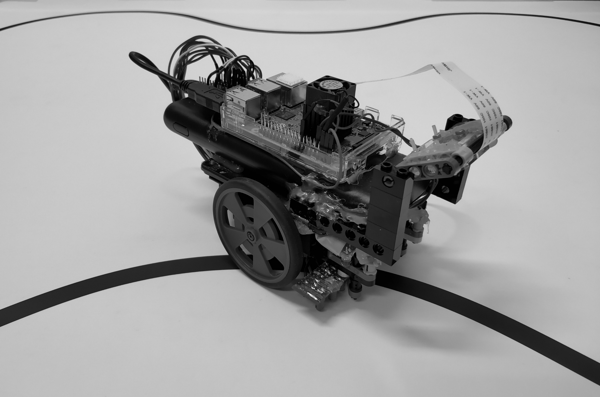

# LineFollowerRobot
This repository provides a platform for online predictive learning in the context of closed-loop robotic systems. The physical robot is built on a SumoBot chassis with a mounted Raspberry Pi that serves as a computation engine for the learning algorithm. The camera provides a vision of the road ahead for prediciton. The steering command from RPi is passed to an Arduino that generates the PWM signal for the robot's servo motors. The Light sensors from the Robot provide instructive feedback to the learner in the form of a closed-loop error signal.

### Building LineFollowerRobot
LineFollowerRobot has the following dependencies that must be installed:
- ``boost``
- ``opencv``

In order to build:
- enter the LineFollowerRobot directory -- ``cd lineFollowerRobot``
- run cmake -- ``cmake .``
- run the build system -- ``make``

This will build the clBP library automatically.

### The robot

